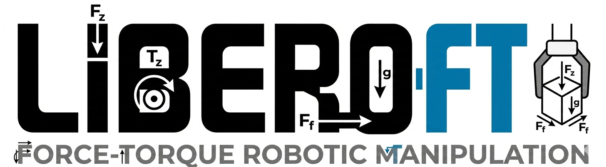

  
  
  # LIBERO-FT: Evaluating Robotic Manipulation with Force-Related Domain Shifts

## Overview

`LIBERO-FT` is a toolkit (including benchmark) developed for evaluating robotic manipulation under force-related domain shifts. 
Highly based on the LIBERO benchmark, it can be considered an extension that builds upon its core functionality. 
Key features include extracting 6D wrench force-torque data from the simulator (Mujoco), replaying and saving benchmark trajectories, 
and modifying physical properties like gripper stiffness and friction to simulate domain shifts (based on Robosuite). 
This repository aims to provide a robust framework for testing and evaluating the adaptability of robotic models to 
varying mechanical conditions, enabling thorough analysis before deploying force-based policies into real-world scenarios.

## Features

- **Read Mujoco 6D force-torque data (MujocoSensorReader)**: Reads raw 6D wrench force-torque data from the native Mujoco sensors and exposes it to the LIBERO `OffScreenRenderEnv` via the `WrenchObsWrapper`.
- **Replay original LIBERO demonstrations and save force-torque data (HDF5Replayer)**: Replays full trajectories based on LIBERO benchmark demonstrations (e.g., LIBERO-90), reading and saving force-torque data into new HDF5 files.
- **Physical domain shift (PhysicsHelper)**: Modifies physical properties like gripper stiffness, friction, and gravity in Robosuite, and evaluates model robustness against mechanical domain shifts using the `LiberoForceSocketEvaluator`.
- **A training&testing example**: Demonstrates training and testing of a diffusion policy with added mechanical inputs, evaluating performance under various domain shifts after in-domain training.

## Installation

To use `LIBERO-FT`, follow the steps below to install dependencies and set up the repository.

### Prerequisites

- Python 3.7+
- Robosuite (and its dependencies)
- [Other necessary libraries like `numpy`, `matplotlib`, `pandas`, etc.]

### Clone the Repository

""
git clone https://github.com/your-username/LIBERO-FT.git
cd LIBERO-FT
"" id="4w2zrt"

### Install Dependencies

""
pip install -r requirements.txt
"" id="o2kjxx"

> **Note**: If you don't have Robosuite installed, please follow the [official Robosuite installation guide](https://robosuite.ai/installation/) to set up the simulator.

## Usage

### Data Extraction

To extract wrench mechanics data from Robosuite, use the following script:

""
python extract_wrench_data.py
"" id="do32fg"

This will extract the 6D force-torque data for evaluation. You can specify the type of tasks or robots from which the data will be extracted.

### Domain Shift Evaluation

Run the evaluation script to analyze the effect of domain shift on robotic manipulation:

""
python evaluate_domain_shift.py --task <task_name> --robot <robot_name>
"" id="0hj56d"

> **Note**: Replace `<task_name>` and `<robot_name>` with the desired task and robot configuration. The repository includes predefined tasks such as `pick_and_place`, `stacking`, etc.

### Visualization

You can visualize the wrench data and evaluation results using the following command:

""
python visualize_results.py
"" id="s43hv9"

This will plot graphs for force-torque distributions and the effects of domain shift.

## Project Structure

""
LIBERO-FT/
│
├── extract_wrench_data.py  # Script for extracting wrench data from Robosuite
├── evaluate_domain_shift.py  # Script for evaluating domain shift
├── visualize_results.py  # Visualization of evaluation results
├── requirements.txt  # List of required dependencies
├── data/  # Folder for storing extracted wrench data
└── README.md  # This file
"" id="6jy9qv"

## Contributing

We welcome contributions to `LIBERO-FT`! If you'd like to contribute, please fork the repository and submit a pull request. Before contributing, please ensure that your code follows the repository’s style and passes all tests.

### How to Contribute

1. Fork the repository.
2. Create a new branch for your feature or bug fix.
3. Write tests for any new functionality.
4. Make sure all tests pass.
5. Submit a pull request with a description of your changes.

## License

This project is licensed under the MIT License - see the [LICENSE](LICENSE) file for details.

## Acknowledgements

- [Robosuite](https://robosuite.ai/) for providing the robotic simulation environment.
- [LIBERO Benchmark](https://libero-benchmark.com/) for force-torque benchmarks used in this project.

---

> **Note**: If any specific part of the code, like force vectors or data handling, is unclear, you might want to include additional clarifications or placeholders where appropriate.
